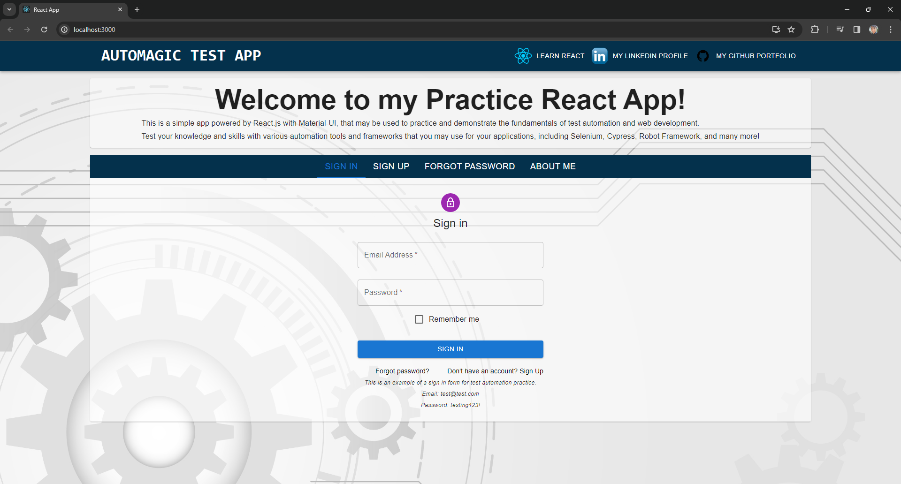

# Getting Started with Create React App

This project was bootstrapped with [Create React App](https://github.com/facebook/create-react-app).

## Running the App locally

In the project directory, run `npm install` to install dependecies. \
Then run `npm start` to run the app locally in development mode.

Open [http://localhost:3000](http://localhost:3000) to view it in your browser.

The page will reload when you make changes.\
You may also see any lint errors in the console.

The app has 4 different tab panels - Sign in, Sign up, Forgot Password, and About me - that I use to practice and demonstrate my automation skills.

The app is also deployed on Netlify: https://automagic-test-app.netlify.app/
